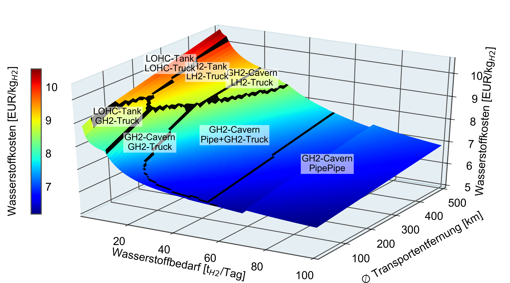

# HIM- Hydrogen Infrastructure Model for Python

HSC offers the functionality to calculate predefined hydrogen supply chain architectures with respect to spatial resolution for the analysis of explicit nationwide infrastructures.

## Installation and application

First, download and install [Anaconda](https://www.anaconda.com/). Then, clone a local copy of this repository to your computer with git

	git clone https://github.com/FZJ-IEK3-VSA/HSCPathways.git
	
or download it directly. Move to the folder

	cd HIM

and install the required Python environment via

	conda env create -f environment.yml 

To determine the optimal pipeline design, a mathematical optimization solver is required. [Gurobi](https://www.gurobi.com/) is used as default solver, but other optimization solvers can be used as well.

## Examples

A number of [**examples**](apps/) shows the capabilities of HIM. Either for [abstract costs analyses](apps/Example%20-%20Abstract%20analysis%20without%20geoferenced%20locations.ipynb) 

 
 
or for [exact infrastructure design](apps/Example%20Hydrogen%20Supply%20Chain%20Cost%20Generation.ipynb) 

 

## License

MIT License

Copyright (C) 2016-2022 Markus Reuss (FZJ IEK-3), Thomas Grube (FZJ IEK-3), Martin Robinius (FZJ IEK-3), Detlef Stolten (FZJ IEK-3)

You should have received a copy of the MIT License along with this program.
If not, see https://opensource.org/licenses/MIT

## About Us 

We are the <a href="https://www.fz-juelich.de/en/iek/iek-3">Institute of Energy and Climate Research - Techno-economic Systems Analysis (IEK-3)</a> belonging to the <a href="https://www.fz-juelich.de/en">Forschungszentrum Jülich</a>. Our interdisciplinary department's research is focusing on energy-related process and systems analyses. Data searches and system simulations are used to determine energy and mass balances, as well as to evaluate performance, emissions and costs of energy systems. The results are used for performing comparative assessment studies between the various systems. Our current priorities include the development of energy strategies, in accordance with the German Federal Government’s greenhouse gas reduction targets, by designing new infrastructures for sustainable and secure energy supply chains and by conducting cost analysis studies for integrating new technologies into future energy market frameworks.

## Acknowledgment

This work was supported by the Helmholtz Association under the Joint Initiative ["Energy System 2050 – A Contribution of the Research Field Energy"](https://www.helmholtz.de/en/research/energy/energy_system_2050/).

